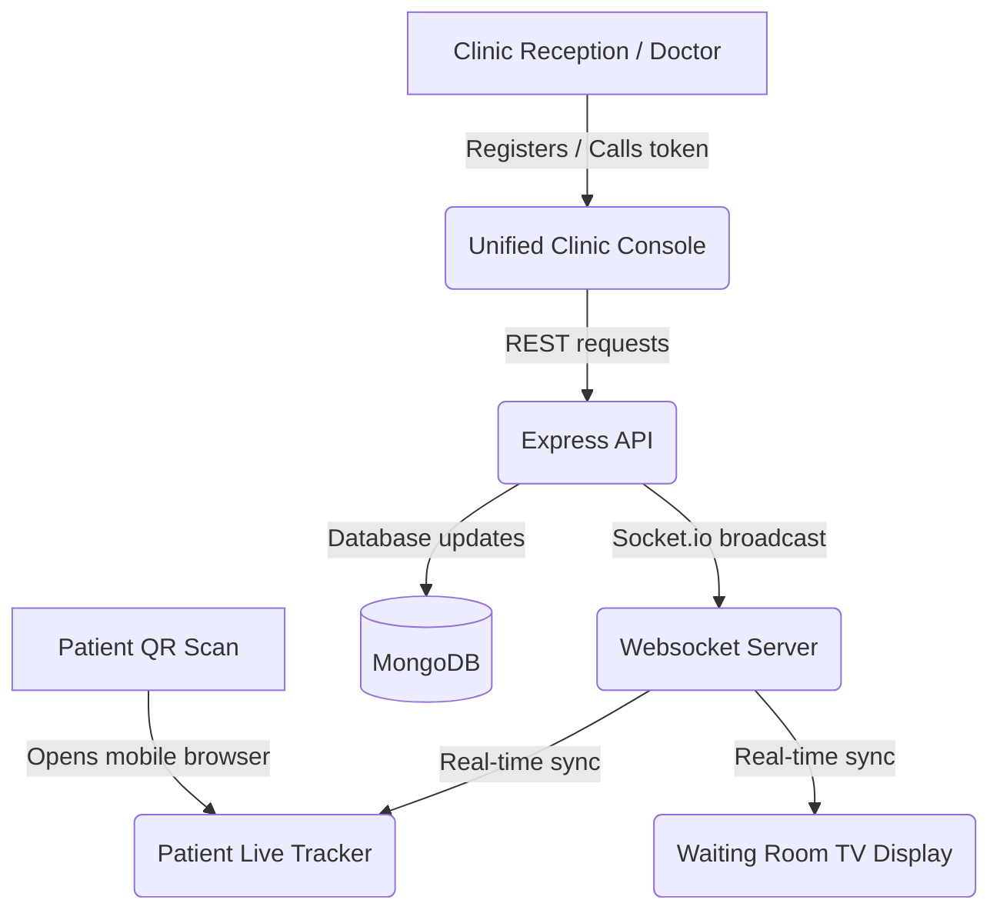

# 🏥 QueueCure SmartReturn

> **Real-time Clinic Queue Intelligence System** — replacing paper tokens, reducing waiting room crowding, and predicting patient wait times with precision.

QueueCure is a modern, real-time queue intelligence solution that allows clinics to automate patient registration, manage consultation states, and dynamically broadcast live wait times to waiting patients on their mobile devices.

---

## 🚀 Live Links & Documentation
* **GitHub Repository**: [https://github.com/raaneshkv/QueueCure](https://github.com/raaneshkv/QueueCure)
* **Supporting Case Study**: [System Architecture & Readme](https://github.com/raaneshkv/QueueCure#readme)

---

## 🔴 The Problem
Waiting in clinic reception areas is stressful, frustrating, and leads to overcrowded, high-risk waiting rooms.
* **Patients** have zero visibility into actual wait times. They are forced to stay close to the clinic, wasting hours.
* **Receptionists** are overwhelmed by manual token calling, priority handling, and constant status inquiries.
* **Clinic Owners** lack operational data (e.g., doctor consultation speeds, hourly patient loads) to optimize scheduling.

---

## 🟢 The Solution (Features)

### 1. ⏱️ SmartReturn Dynamic Wait-Time Engine
Instead of arbitrary queue numbers, our algorithm tracks actual doctor consultation speeds today. It calculates a dynamic moving average of consultation times and tells patients exactly when they need to return to the clinic (e.g. `Return by 04:30 PM`).

### 2. 📱 Patient Tracker Screen
Patients scan a QR code at reception to open a live tracking screen on their phone.
* **HSL Color-Coded States**:
  * **Green (Safe)**: Patient is far back in the queue. They can wait in a nearby cafe or run errands.
  * **Orange (Nearby)**: Patient is 2 tokens ahead. Urges them to start returning.
  * **Blue (Enter)**: It's their turn!
* **Browser Push Notifications**: Alerts patients automatically when they hit return milestones.

### 3. 🖥️ Unified Clinic Console & Public Display Board
* **Clinic Console**: A single dashboard for receptionists and doctors to register patients, call tokens, skip, pause/resume the queue, and track status.
* **Public Display**: A waiting room board that displays currently serving and next tokens with built-in voice announcement alerts.

### 4. 📊 Owner Analytics
A premium analytics panel tracking:
* **Hourly Patient Loads** (bar charts)
* **Visit Type Distributions** (pie charts for general, follow-up, vaccination, emergency)
* **Doctor Performance** (average, fastest, and longest consultation durations)

---

## 🛠️ Technology Stack

| Layer | Technologies Used |
| :--- | :--- |
| **Frontend** | React 18, Vite, Context API, Lucide Icons, Recharts, Sonner Notifications, CSS Custom Variables |
| **Backend** | Node.js, Express, Socket.io (WebSocket with state recovery) |
| **Database** | MongoDB (Mongoose), MongoMemoryServer (for local developer in-memory fallback) |

---

## 📐 System Architecture & Data Flow



---

## ⚙️ Setup & Local Development

### 1. Install dependencies
```bash
npm run install:all
```

### 2. Start the development servers
```bash
npm run dev
```
* **Frontend Client**: `http://localhost:5173`
* **Backend Server**: `http://localhost:5001` (automatically runs an in-memory MongoDB database if local MongoDB isn't running)

---

## ☁️ Deployment Guide

### Backend (Render / Railway)
1. Deploy the `server` directory as a Node.js web service.
2. Define `MONGODB_URI` environment variable pointing to your production database.

### Frontend (Vercel)
1. Import the repository and set the **Root Directory** to `client`.
2. Define the environment variable:
   * `VITE_API_URL`: Your hosted backend service URL.
